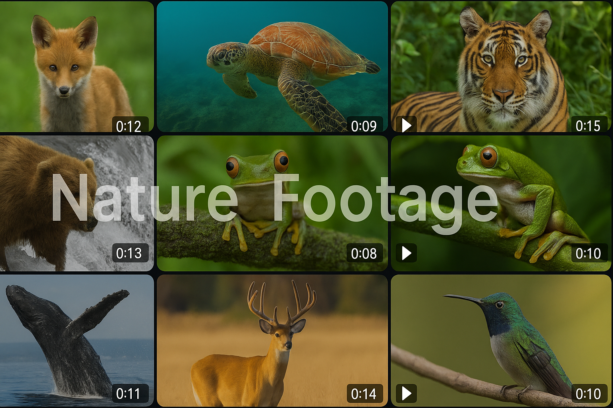

<p align="center">
  
</p>

<h1 align="center">Nature Footage</h1>

AI driven platform for **Nature Footage Search & Recommendations**, tapping into a stock library of over 4,000 hours of wildlife, ocean, and natural scenery — ranging from **4K Royalty-Free clips** to **12K Premium Footage**.

🎥 Backed by 750+ professional filmmakers and covering over 6,000 species globally. The purpose of this platform is to enhances discovery using **semantic video search and intelligent Video-to-Text for video details generation** with **TwelveLabs Marengo & Pegasus models**.

---

## 📚 Table of Contents

* [Features](#-features)
* [Tech Stack](#-tech-stack)
* [Local Setup](#-local-setup)
* [Index and Status](#-index-and-status)
* [Video Management](#-video-management)
* [Video Search](#-video-search)
* [Video Analysis](#-video-analysis)
* [Video Embeddings](#-video-embeddings)
* [Weaviate Operations](#-weaviate-operations)
* [Testing with Payloads from File](#-testing-with-payloads-from-file)

---

## 🚀 Features

* 🔎 **Semantic Video Search** using TwelveLabs Search Endpoint.
* 🧠 **Pegasus Model Usage** for auto labeling and descriptive video details..
* ⚡ **Automatic Metadata Generation** with timestamps and clip scene level insights.
* 📦 **Video Embeddings Storage** in Weaviate for real time similarity search (video to video for recommendation).
* 🔁 **Video-to-Video Recommendations** with fast nearest-neighbor lookup.
* 💾 **Caching Mechanism** for speeding up retrieval of frequently viewed content (Storing in metadata)
* 📊 **Confidence Scoring System** for video level and clip level evaluations.

---

## 🛠 Tech Stack

* **Frontend** – Next.js
* **Backend** – Python (Flask)
* **AI Services** – [TwelveLabs API](https://docs.twelvelabs.io/) (Marengo & Pegasus)
* **Vector DB** – [Weaviate](https://weaviate.io/)

---

## ⚙️ Local Setup

1. **Clone the repository**

   ```bash
   git clone https://github.com/Hrishikesh332/Twelve-Labs-Nature-Footage.git
   cd Twelve-Labs-Nature-Footage
   ```

2. **Set up a virtual environment**

   ```bash
   python3 -m venv venv
   source venv/bin/activate  # On Windows: venv\Scripts\activate
   ```

3. **Install dependencies**

   ```bash
   pip install -r requirements.txt
   ```

4. **Add Environment Variables**

   Do copy and have a look at the `.env.example`

5. **Run the Flask app**

   ```bash
   python app.py
   ```

6. **Live At**

  `http://localhost:5000`

---


## 🧭 Index and Status

```bash
# Get index information
curl -X GET http://localhost:5000/api/index

# Test connections to all services
curl -X GET http://localhost:5000/api/test
```

---

## Video Management

```bash
# List videos with pagination and sorting
curl -X GET "http://localhost:5000/api/videos?page=1&limit=50&sort_by=created_at&sort_option=desc"

# Filter videos by filename
curl -X GET "http://localhost:5000/api/videos?filename=beach"

# Get information for a specific video
curl -X GET http://localhost:5000/api/videos/{video_id}

# Get video information with embeddings
curl -X GET "http://localhost:5000/api/videos/{video_id}?include_embeddings=true"

# Stream video from S3
curl -X GET http://localhost:5000/api/video/{path_to_video}

# Get metadata for a specific video
curl -X GET http://localhost:5000/api/metadata/{video_id}

# Update full metadata object
curl -X PUT http://localhost:5000/api/metadata/{video_id} \
  -H "Content-Type: application/json" \
  -d '{"custom_field": "custom_value"}'

# Update a single metadata field
curl -X PUT http://localhost:5000/api/metadata/{video_id}/field \
  -H "Content-Type: application/json" \
  -d '{
    "field_name": "custom_field",
    "field_value": "new_value"
  }'
```

---

## 🔍 Video Search

```bash
# Search videos by text prompt
curl -X POST http://localhost:5000/api/search \
  -H "Content-Type: application/json" \
  -d '{
    "query_text": "underwater monkey shot",
    "options": ["visual"],
    "page_limit": 15,
    "threshold": "high"
  }'

# Fetch next page of search results
curl -X POST http://localhost:5000/api/search/next \
  -H "Content-Type: application/json" \
  -d '{
    "page_token": "token_from_previous_search"
  }'
```

---

## Video Analysis

```bash
# Analyze a single video
curl -X POST http://localhost:5000/api/analyze/{video_id} \
  -H "Content-Type: application/json" \
  -d '{
    "use_lambda": false
  }'

# Batch analyze all indexed videos
curl -X POST http://localhost:5000/api/batch-analyze \
  -H "Content-Type: application/json" \
  -d '{
    "use_lambda": false
  }'

# Batch analyze selected videos
curl -X POST http://localhost:5000/api/batch-analyze \
  -H "Content-Type: application/json" \
  -d '{
    "video_ids": ["video_id_1", "video_id_2", "video_id_3"],
    "prompt": "Describe this video in detail.",
    "use_lambda": false,
    "limit": 10
  }'

# Download full analysis report
curl -X GET "http://localhost:5000/api/download/report?type=all" --output analysis_report.csv

# Download only successful analyses
curl -X GET "http://localhost:5000/api/download/report?type=successful" --output successful_analysis.csv
```

---

## 🧬 Video Embeddings

```bash
# Generate embeddings for all videos in batches
curl -X POST http://localhost:5000/api/batch-embed \
  -H "Content-Type: application/json" \
  -d '{
    "page_size": 50,
    "max_pages": 5,
    "delay_seconds": 2
  }'

# Check embedding status
curl -X GET http://localhost:5000/api/embedding-status

# Download embedding status CSV
curl -X GET http://localhost:5000/api/download/embedding-status --output embedding_status.csv

# Get embedding for a specific video
curl -X GET http://localhost:5000/api/embedding/{video_id}

# Store a video's embedding in Weaviate
curl -X POST http://localhost:5000/api/store-embedding/{video_id}
```

---

## Weaviate Operations

```bash
# Recreate the entire schema
curl -X POST http://localhost:5000/api/recreate-schema

# Get similar videos to a given video ID
curl -X GET "http://localhost:5000/api/similar-videos/{video_id}?limit=6"

# Debug similar video retrieval
curl -X GET http://localhost:5000/api/debug-similar-videos/{video_id}

# Execute audio duplicate deletion
curl -X POST http://localhost:5000/api/delete-audio-duplicates

# Preview audio duplicates (non-destructive)
curl -X GET http://localhost:5000/api/preview-audio-duplicates

# Get collection statistics
curl -X GET http://localhost:5000/api/collection-stats
```

---


